# Module 11 Challenge: Forecasting Net Prophet

## Submission

- Google Colab Link: [here](https://colab.research.google.com/drive/1p1oYucqyjLSk2QfLGGdEucEz4RLYNUUX#scrollTo=nZOnWsJnX7Na)

## Steps

The instructions are divided into four steps and an optional fifth step as follows:

- Step 1: Find unusual patterns in hourly Google search traffic.

- Step 2: Mine the search traffic data for seasonality.

- Step 3: Relate the search traffic to stock price patterns.

- Step 4: Create a time series model by using Prophet.

- Step 5 (optional): Forecast the revenue by using time series models.

The following subsections detail these steps.

### Step 1: Find Unusual Patterns in Hourly Google Search Traffic

1. Read the search data into a DataFrame, and then slice the data to just the month of May 2020. (During this month, Mercado Libre released its quarterly financial results.) Use hvPlot to visualise the results. Do any unusual patterns exist?
   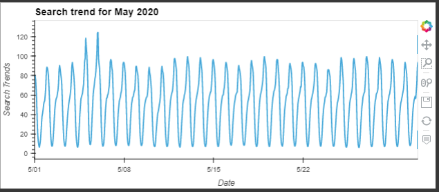

2. Calculate the total search traffic for the month, and then compare the value to the monthly median across all months.
   - Google search traffic increase during the month that Mercado Libre released its financial results. Traffic in May 20 (37,014) is higher than median traffic across all months (35,172.5).

### Step 2: Mine the Search Traffic Data for Seasonality

1. Group the hourly search data to plot the average traffic by the day of the week (for example, Monday vs. Friday).
   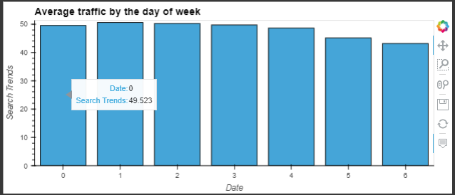

2. Using hvPlot, visualise this traffic as a heatmap, referencing `index.hour` for the x-axis and `index.dayofweek` for the y-axis. Yes, the search trends concentrate from 22:00 to about 3:00 next day. In fact, the search trends appear to concentrates in that time period across all days of the week.
   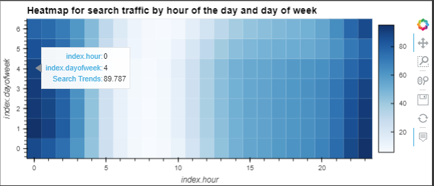

3. Group the search data by the week of the year. Does the search traffic tend to increase during the winter holiday period (weeks 40 through 52)? Yes, after the initial dip in week 41, the traffic trend increase before falling off in week 51.
   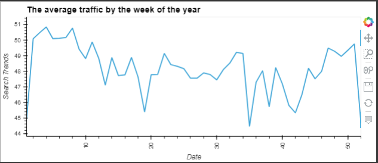

### Step 3: Relate the Search Traffic to Stock Price Patterns

1. Read in and plot the stock price data. Concatenate the stock price data to the search data in a single DataFrame.
   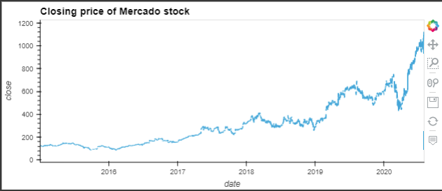

2. Note that market events emerged during 2020 that many companies found difficult. But after the initial shock to global financial markets, new customers and revenue increased for e-commerce platforms. So, slice the data to just the first half of 2020 (`2020-01` to `2020-06` in the DataFrame), and then use hvPlot to plot the data. Do both time series indicate a common trend that’s consistent with this narrative?
   - Stock price graph shows a dip in April and sees the share price rallies in to June.
   - However, the search trends does not show a clear trend. In fact, it appears to be a drop in search trends towards the end of the periods. There is spike in search trend on 5/5/2020, which coincides with a spike in share price (about 15%). This could mean there is a price sensitive annoucement on that date.
     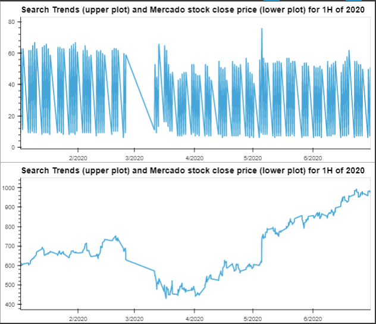
3. Create a new column in the DataFrame named “Lagged Search Trends” that offsets, or shifts, the search traffic by one hour. Create two additional columns:

   - “Stock Volatility”, which holds an exponentially weighted four-hour rolling average of the company’s stock volatility
     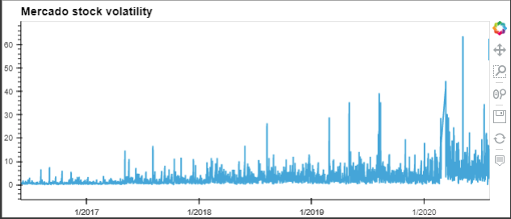
   - “Hourly Stock Return”, which holds the percentage of change in the company stock price on an hourly basis

4. Review the time series correlation, and then answer the following question: Does a predictable relationship exist between the lagged search traffic and the stock volatility or between the lagged search traffic and the stock price returns?
   - There is a low correlation between lagged search traffic and the stock volatility, and between the lagged search traffic and the stock price returns. It does not appear to have any predictable relationship.
     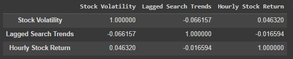

### Step 4: Create a Time Series Model by Using Prophet

1. Set up the Google search data for a Prophet forecasting model.

2. After estimating the model, plot the forecast. What is the near-term forecast for the popularity of Mercado Libre?

   - The near-term forecast shows a declining popularity of MercadoLibre
     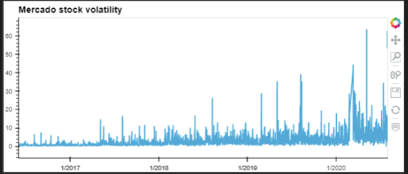

3. Plot the individual time series components of the model to answer the following questions:
   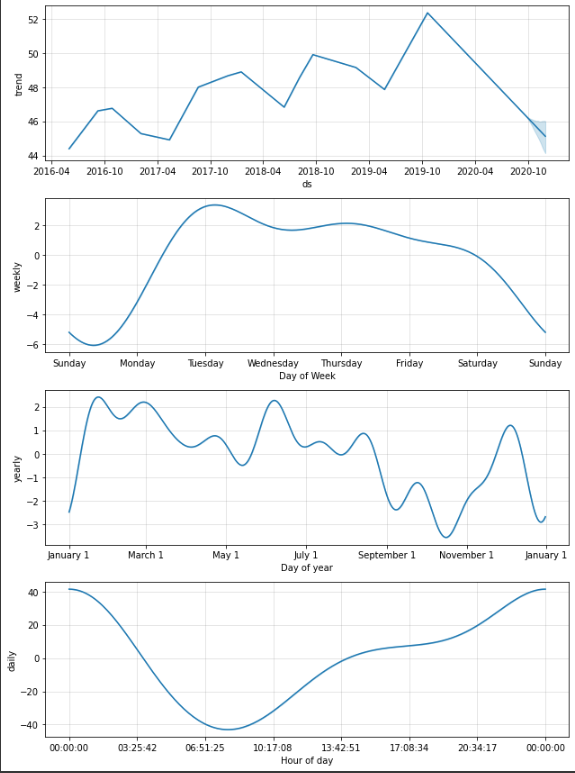

   - What time of day exhibits the greatest popularity?

     - Around midnight

   - Which day of the week gets the most search traffic?

     - Tuesday, followed by Thursday and Wednesday

   - What's the lowest point for search traffic in the calendar year?
     - Mid October

### Step 5 (Optional): Forecast the Revenue by Using Time Series Models

1. Read in the daily historical sales (that is, revenue) figures, and then apply a Prophet model to the data.
   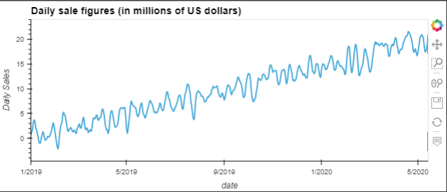

2. Interpret the model output to identify any seasonal patterns in the company revenue.
   - The peak revenue days are Wednesday, then Tuesday and Monday
     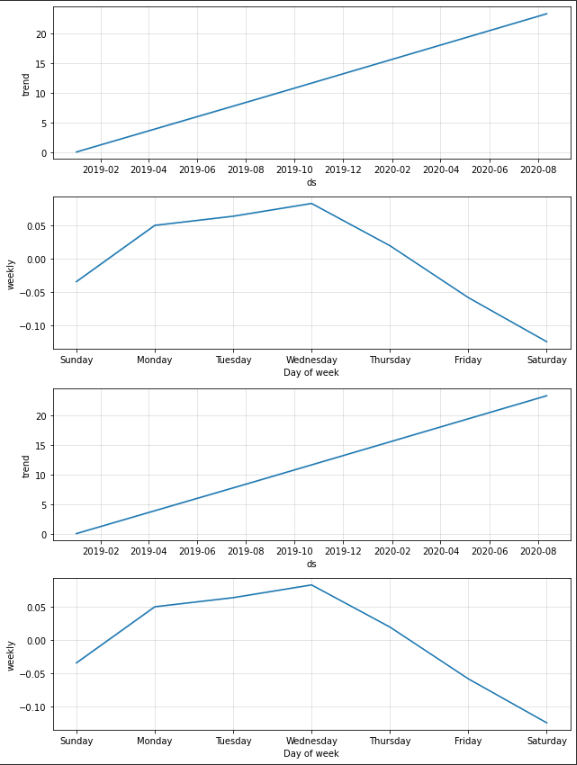
3. Produce a sales forecast for the finance group. Give them a number for the expected total sales in the next quarter. Include the best- and worst-case scenarios to help them make better plans.
   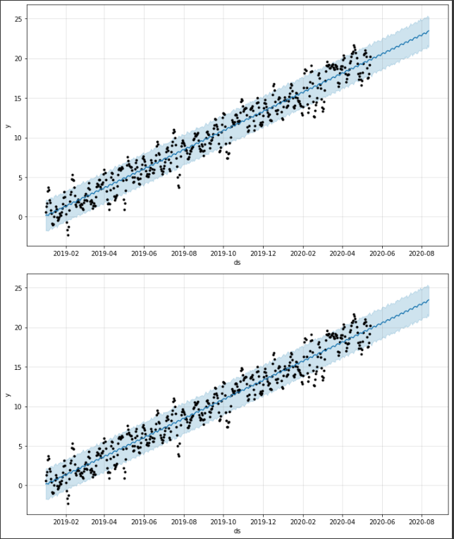
   - the best case is $1,051 Mil,
   - the worst case is $888 Mil,
   - the most likely case is $969 Mil.

---
